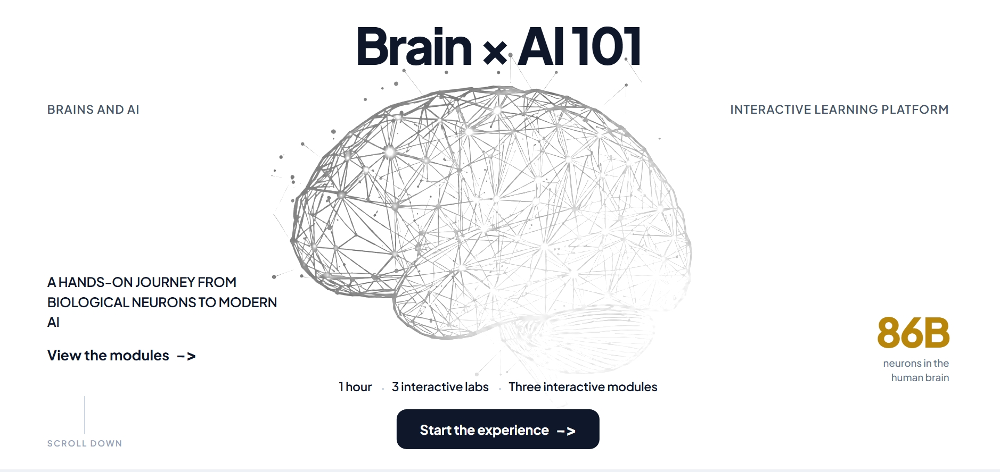
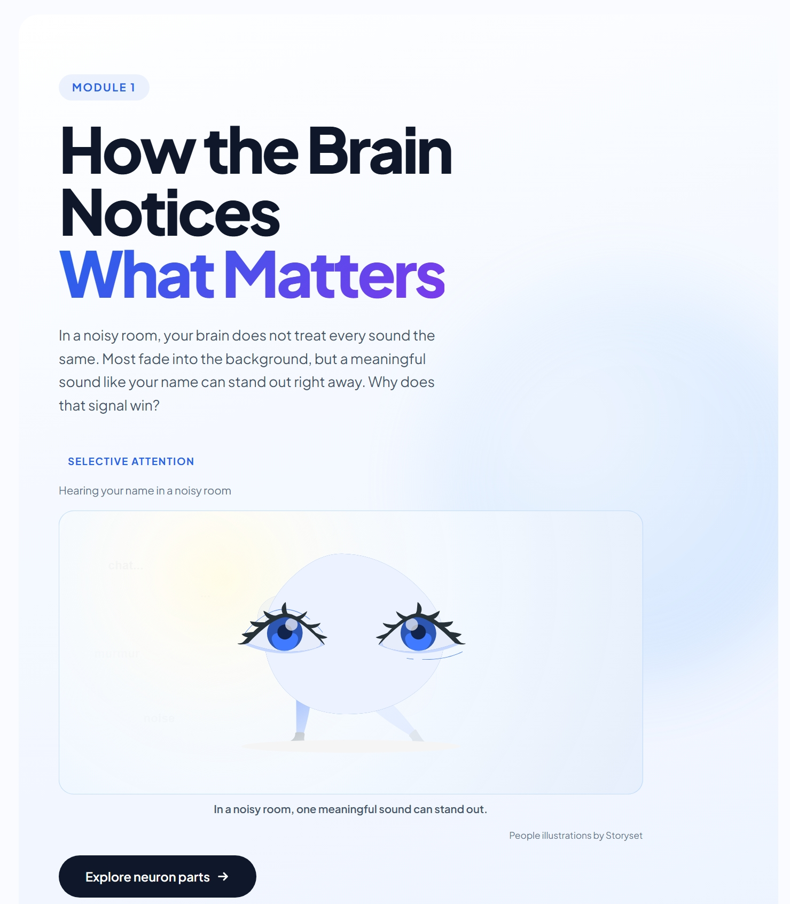
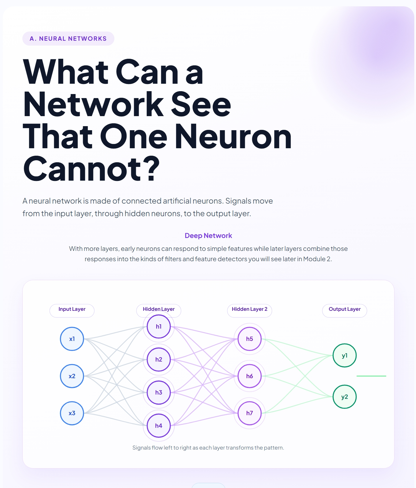
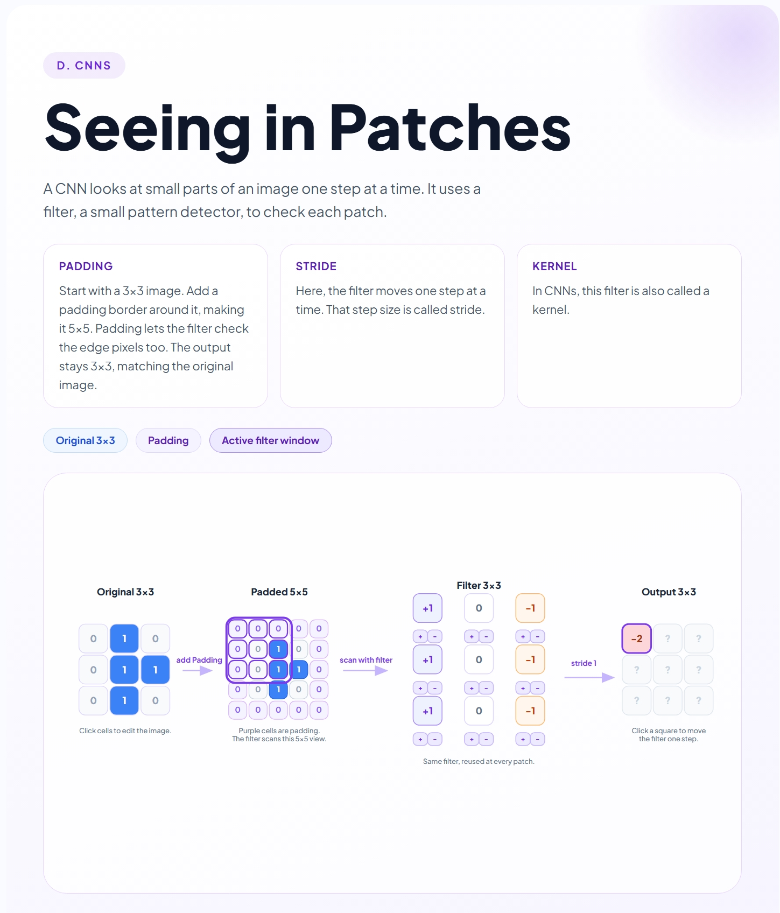
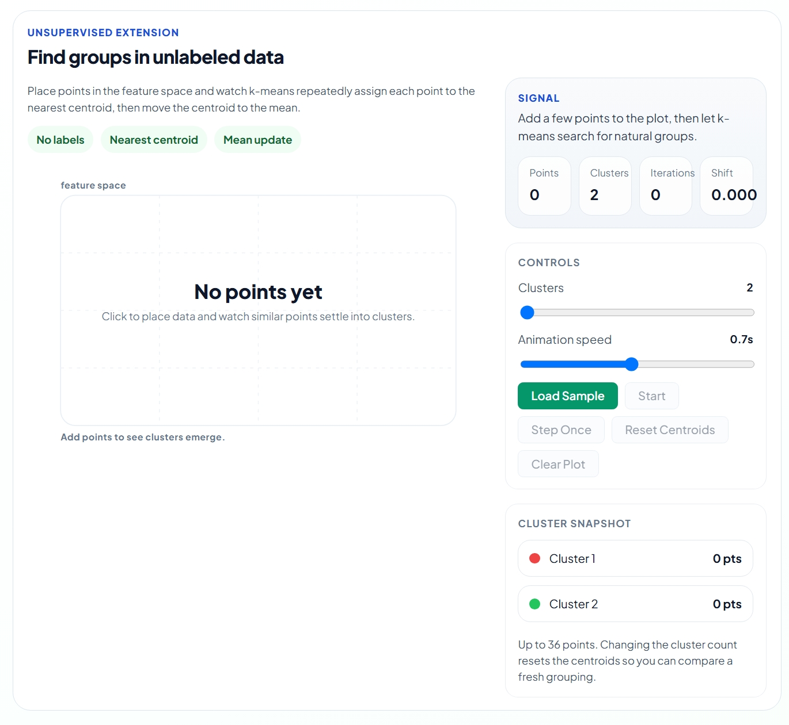
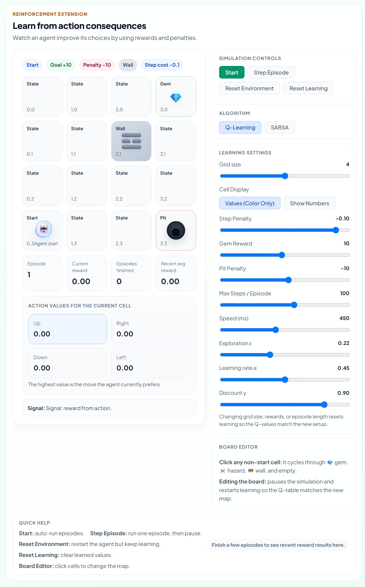
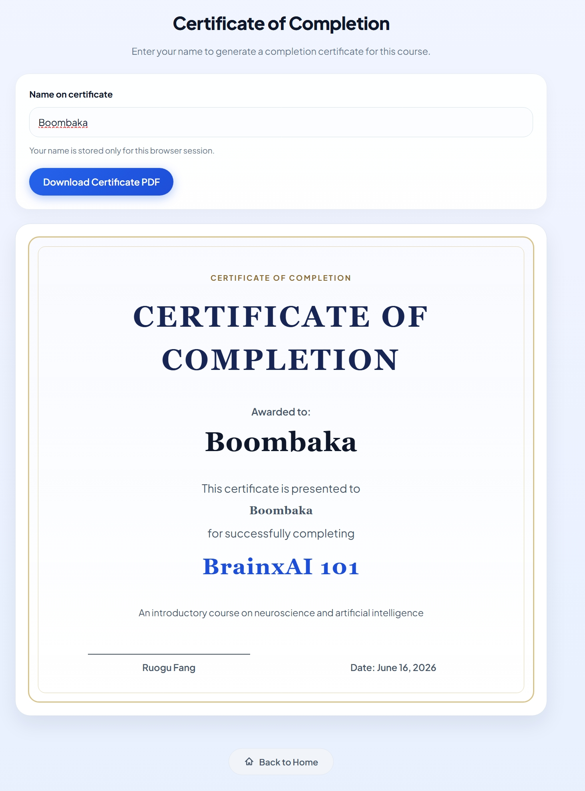

# Brain × AI 101

An interactive neuroscience + AI learning platform that turns neurons, networks, filters, and feedback into guided web experiences.

## Preview

### Landing Page



### Core Learning Modules

<table>
  <tr>
    <td width="50%">
      
      <br />
      <strong>Module 1 · Biological Neurons</strong>
    </td>
    <td width="50%">
      
      <br />
      <strong>Module 2 · Artificial Neural Networks</strong>
    </td>
  </tr>
  <tr>
    <td width="50%">
      
      <br />
      <strong>Module 2 · CNN Vision Lab</strong>
    </td>
    <td width="50%">
      
      <br />
      <strong>Module 3 · Unsupervised Learning</strong>
    </td>
  </tr>
</table>

### Advanced Learning Labs

<table>
  <tr>
    <td width="50%">
      
      <br />
      <strong>Reinforcement Learning Lab</strong>
    </td>
    <td width="50%">
      
      <br />
      <strong>Completion Page</strong>
    </td>
  </tr>
</table>

## What It Is

Brain × AI 101 is a React-based educational web app that connects biological signal processing to artificial neural networks and feedback-driven learning. Instead of presenting AI concepts as static text, it teaches them through embedded simulations, guided labs, animated diagrams, and module-based interactions.

The product is structured as a step-by-step frontend experience: students move from neurons, to pattern recognition, to learning systems, then finish with evaluations and a completion flow. Research context matters, but the project is implemented as a practical interactive web application first.

## Product Flow

Landing Page → Pre-Course Evaluation → Module 1 → Module 2 → Module 3 → Course Evaluation → Completion

## Implemented Learning Surfaces

| Module | Concept | User Interaction | Implementation |
| --- | --- | --- | --- |
| Module 1 | Biological neuron basics | Explore a guided neuron lesson with anatomy, firing, and selective response | Section-based React components with animated transitions and module-local content |
| Module 1 | Sound experiment | Trigger signals and watch neuron response behavior change | Interactive experiment UI tied to Module 1 state and response logic |
| Module 1 | Threshold and firing | Use soma/response surfaces to see when a neuron activates | Visual meters and live explanation panels in the interaction section |
| Module 1 | PhET neuron simulation | Use an embedded neuron simulator inside the lesson flow | Lesson wrapper around an embedded PhET simulation with local/live URL handling |
| Module 1 | Bridge to AI | Transition from biological neurons to artificial ones | Dedicated bridge section that closes Module 1 and hands off to Module 2 |
| Module 2 | ANN layers | Step through how a network grows from one neuron to deeper layers | Staged SVG-based React visualization with controlled state |
| Module 2 | Activation functions | Compare how activations shape outputs | Interactive activation demo built as a module section |
| Module 2 | Neural selectivity | See how different neurons respond to different features | Module-owned activities and supporting visuals for selectivity |
| Module 2 | CNN scanning/filter lab | Edit image cells, change kernels, and inspect convolution outputs | Interactive scanning lab with kernel presets, receptive field movement, and computed outputs |
| Module 2 | CNN Explainer | Open or view an embedded external CNN explainer | Lesson component that embeds the explainer and provides fallback links |
| Module 3 | Feedback loop | Follow prediction, error, and update steps over time | Animated instructional sections that visualize adjustment across steps |
| Module 3 | Learning types | Compare supervised, unsupervised, and reinforcement learning | Content sections plus linked labs that connect each learning type to a concrete interaction |
| Module 3 | Backpropagation | Inspect how errors move backward and weights update | Purpose-built visual walkthrough with staged explanation panels |
| Module 3 | K-means clustering | Place points and watch clusters re-form | Interactive clustering lab with controls, stats, and tests |
| Module 3 | Reinforcement learning grid lab | Run episodes, tune rewards, edit the board, and compare policies | Grid-based RL lab with adjustable settings and embedded control panel |
| Evaluation | Pre-course questionnaire | Answer or skip the pre-course evaluation before entering the course | Separate evaluation flow stored locally and integrated into app-level navigation |
| Evaluation | Post-course feedback | Submit structured feedback after finishing Module 3 | Feedback flow backed by persisted evaluation attempts |
| Evaluation | Knowledge check | Complete a scored question set at the end of the course | Question data, answer keys, scoring, and submission hooks |
| Evaluation | Completion | Review the course and generate a certificate PDF | Completion page with certificate preview and browser-side PDF export |

## How the Software Works

The frontend is built with React 19 and Vite and uses app-level view state instead of React Router. The entire course runs as a guided single-page flow controlled from the app shell, which makes it easy to preserve progress, move between modules, and keep the experience feeling continuous.

Redux Toolkit manages the current view, module progress, pre-course evaluation state, and course evaluation state. Each module owns its own section components and interactions, while shared UI and hooks handle recurring patterns like navigation, scrolling, and persistence.

Progress and evaluation attempts are persisted in the browser with `localStorage` and session storage so learners can resume without losing their place. When backend support is configured, Vercel Functions receive quiz and evaluation submissions, and Prisma + PostgreSQL store those records for longer-term access and admin review.

External learning tools are treated as lesson surfaces, not side links. The app wraps embedded simulations and visual tools such as PhET, CNN Explainer, and the TensorFlow Playground inside module components so they fit the same course flow as the in-house React interactions.

## Evaluation and Data Handling

- The pre-course evaluation can be skipped so users are not blocked from entering the course.
- The post-course flow combines feedback prompts with a knowledge check.
- Quiz scoring is based on structured question data and answer keys rather than hard-coded result screens.
- Progress, evaluation attempts, and certificate name state persist locally in the browser.
- When the backend is configured, quiz and evaluation attempts can also be submitted to persistent storage.
- No names or email addresses are required by default to use the course.

## Project Structure

```text
src/
  modules/
    LandingPage/
    Module1/
    Module2/
    Module3/
    CourseEvaluation/
  components/
  store/
  hooks/
api/
prisma/
public/
docs/screenshots/
```

## Tech Stack

- Frontend: React 19, Vite
- State: Redux Toolkit
- Animation/visualization: Framer Motion, GSAP, Three.js / React Three Fiber
- Backend: Vercel Functions, Prisma, PostgreSQL
- Deployment: Vercel, GitHub Pages

## Running Locally

```bash
npm install
npm run dev
npm run build
npm run test:run
npm run prisma:generate
npm run prisma:migrate:dev
npm run prisma:seed
```

## Deployment

For a frontend-only deployment, the project can be published from the generated `dist` folder to GitHub Pages:

```bash
npm run deploy
```

For deployments that need API routes, submission storage, and Prisma-backed persistence, use Vercel. The build command is:

```bash
npm run vercel-build
```

The output directory is `dist`.

## External Resources

- PhET Neuron
- CNN Explainer
- TensorFlow Playground

## Attribution

Attribution links used by the app are recorded in `src/assets/attribute.txt`
